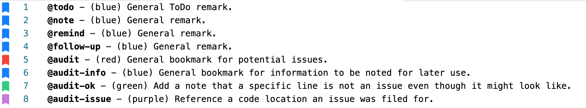

# Solidity Audit Report Format

> Natspec/Radspec-like commenting for audit reports

## Overview

This expands the default `Generated Reports` available from Consensys Dilligence

## Generated Report

[vscode - inline bookmarks](https://github.com/tintinweb/vscode-inline-bookmarks)

```ts
@todo - (blue) General ToDo remark.
@note - (blue) General remark.
@remind - (blue) General remark.
@follow-up - (blue) General remark.
@audit - (red) General bookmark for potential issues.
@audit-info - (blue) General bookmark for information to be noted for later use.
@audit-ok - (green) Add a note that a specific line is not an issue even though it might look like.
@audit-issue - (purple) Reference a code location an issue was filed for.
@docs - (white) Reference a location or provide inline informative explainer
@legal - (grey) Reference a potential legal issue 
@tests - (yellow) Reference a code location that is specific for _testing_ purposes
@tests-modify - (orange) Reference a code location for _injection_ of a test snippet or interface for _testing_
```

## Sample



## Configuration

`audit_report_config.json`

## License

ISC 
